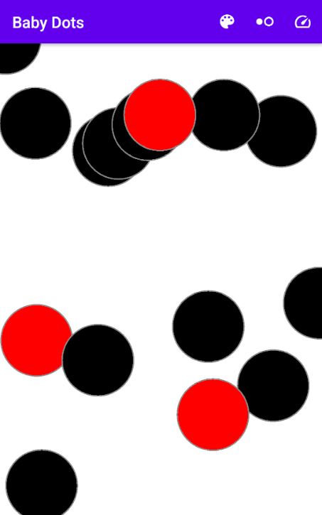
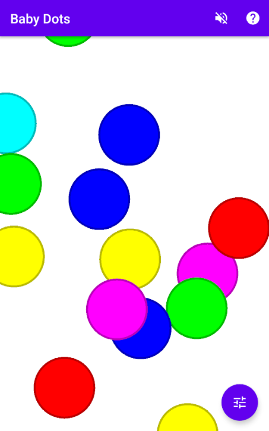
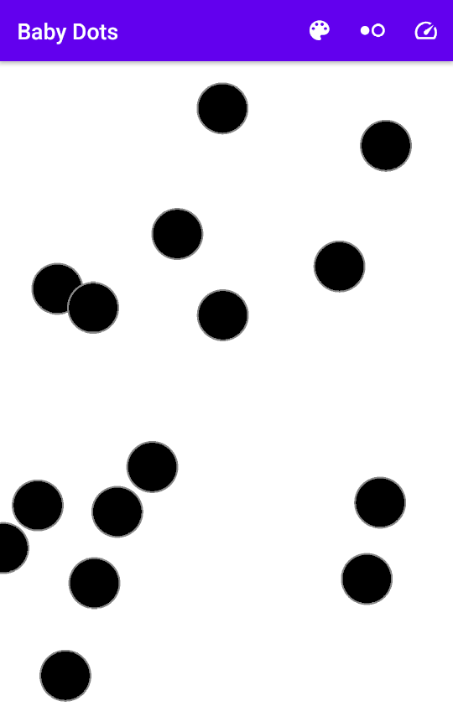

# Baby Dots

 

Baby dots is a sensory Android app designed to calm and relax young babies.

Anecdotally, these helped our little baby smile since four months old, no matter how upset she may have been.

  

## Contributing

### Donations

Baby Dots is an open source, GPLv3 application. It will always be freely available via F-Droid, or for anyone to build, fork, or improve via the source code.

If you wish to support the development financially, you can do so via:

* [Liberapay](https://liberapay.com/BabyDots/donate)
* [GitHub sponsors](https://github.com/sponsors/pserwylo)
* [Google Play](https://play.google.com/store/apps/details?id=com.serwylo.babydots) - The version on Google Play is the exact same version as F-Droid (i.e. the .apk​ built and signed by F-Droid). However, it is available for a minimal price to facilitate donations to support development.

### Reporting Issues

Please report any issues or suggest features on the [issue tracker](https://github.com/babydots/babydots/issues).

### Submitting changes

Pull requests will be warmly received at [https://github.com/babydots/babydots](https://github.com/babydots/babydots).

## Compiling

This app uses a typical `gradle` folder structure and is written in Kotlin.

 * To build (a debug version): `gradle assembleDebug`

Alternatively, you can import the project into Android Studio and build from there.